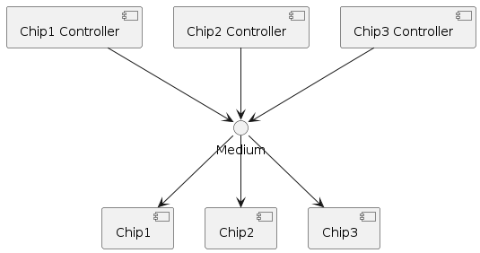
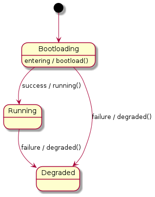
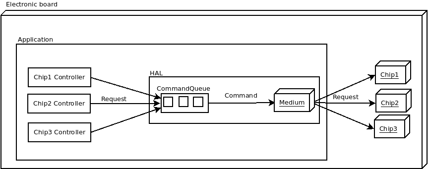

# Command pattern

For more information about the Command pattern, read the book "SFML Game Development" by Artur Moreira, Henrik Vogelius Hansson, Jan Haller (Edition Packt Publishing), Chapter 4: Command and Control -- Input Handling.

## Context

In this example, let's suppose we have to implement a single application holding more than one `ChipController` class communicating with their associated microcontroller `Chip` through a single medium of communication (SPI or I2C ...).
Each `ChipController` sends a message to its `Chip`, wait for an answer and parse it once received.

The following figure depicts the architecture:




The communication protocol is mainly decomposed as:
- `ChipController1` sends a message to its `Chip1` (request).
- `Chip1` needs some delay to interpret the request and prepare the answer.
- `ChipController1` waits for an answer from `Chip1`.
- `Chip1` send for an answer from `Chip1`.
- `ChipController1` interprets the answer and does actions with it.

The `ChipController2` controls `Chip2`. The `ChipController3` controls `Chip3` and so long.

All communications are passed to a unique communication medium (SPI or I2C ...). All `ChipController` is managed by a single application `Application` and we do not want they block each other (i.e. `ChipController1` is waiting for the answer from `Chip1` but blocks `ChipController2` for sending its request to `Chip2`).

The following figure depicts the state machine for each `ChipController`:



This is a very basic state machine:
- The `Chip` when wakes up, enters its `bootloader` mode.
- The `ChipController` shall send commands to flash the `Chip`.
- Once done, the` bootloadable` application of the `Chip` is `running` and `ChipController` can interact with it.
- Any failure makes the `ChipController` enters a `degraded` mode.

## Solution

The following figure depicts the code implemented in C++17. For clarity, on this figure, we did not show `Chip` answers.



- `Medium` of communication can be SPI, or I2C. In this example, we stub it because we do not have hardware.
- `Commands` are based on `std::function`. They known the communication medium, contain the message to send and how to parse the answer once received.
- The `CommandQueue` is a thread-safe queue based on `std::queue`. The queue allows for serialization to send
  commands.
- `std::future` and `std::promise` allows getting Chip answers and using them afterward. In our case, we use them
  to do simply `Medium::send(message); Medium::WaitAnswer(); answer := Medium::read()`.
- `HAL` (means for Hardware Abstraction Layer) holding the `CommandQueue` and the `Medium`.
- The application starts X threads running `ChipController` (their states are based on the state machine).

Compilation:
```
g++ --std=c++17 -Wall -Wextra -UFSM_DEBUG -DFSM_MOCKABLE *.cpp -lpthread
./a.out
```

**Note:** C++17 was needed because `sd::optional` are used in `CommandQueue` to manage a dummy command when a timeout occurred when trying to pop a command. Timeouts are not strictly necessary for this demo.

Advantages of this solution:
- Each component is unitary testable (Controller, Command, Queue, Medium).
- Mutex is only managed by the Queue. No risk of deadlock by miss usage by letting the developer uses it for each command he wants to send.
- Simplicity of the code: no more management done in a single-threaded application to know when `ChipController` can access the medium without impacting other `ChipController`.
- This pattern can quickly be reused for several projects.

The disadvantages of this solution:
- the initial code complexity to set. You have to understand `std::future`, how to thread-safe a queue (mutex, condition variable), `std::function`.
- Management of asynchronous results: C++ is not a native reactive language. Code can more complex than language like Esterel.
