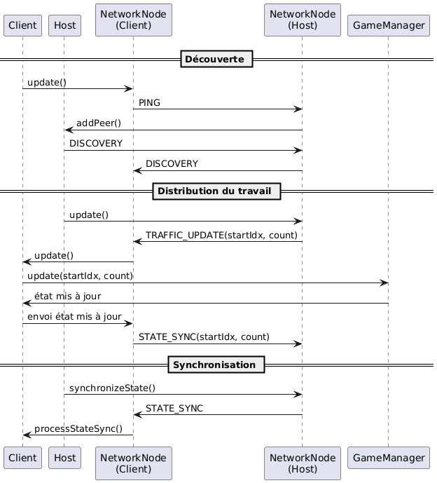

# SimCity P2P

A distributed P2P city simulation where each client contributes to simulation computations.

## Game Description

SimCity P2P is a simplified city simulation where:
- Buildings generate revenue
- Cars move between buildings on a road network
- Each client is identified by a unique color
- The economy is managed through a taxation system

### Objectives

- Demonstrate P2P architecture with load distribution
- Simulate a simple economy with revenue-generating buildings
- Manage road traffic between buildings

## Game State

The game state consists of three main components:

### Traffic
- Cars moving on the road network
- Each car has:
  - Current position and destination
  - Speed and direction
  - Owner (client color)
- Traffic calculations are distributed among clients

### Economy
- Buildings:
  - Position and type
  - Revenue generation rate
  - Owner (client color)
- Global economy:
  - Tax rates
  - Treasury balance
  - Revenue distribution

### Infrastructure
- Road network:
  - Road segments and intersections
  - Traffic capacity and flow
- Building plots:
  - Available locations
  - Construction zones
  - Land value

## Software Architecture

### Overview

The system uses a hybrid P2P architecture with a central host that:
- Coordinates peer discovery
- Distributes computational load
- Synchronizes the global game state

### Main Components

- **Client**: Handles graphics rendering and user interface
  - Inherits from `NetworkNode` for network communication
  - Maintains a local copy of `GameState`
  - Performs assigned calculations

- **Host**: Extends Client with additional functionality
  - Distributes computational load among clients
  - Maintains the reference game state
  - Periodically synchronizes all clients

- **NetworkNode**: Manages all network communication
  - Peer discovery
  - Message sending/receiving
  - Timeout management

- **GameManager**: Contains game business logic
  - Updates car positions
  - Economic calculations
  - Game state validation

## Network Protocol

The system uses several message types:
- **Discovery Messages**
  - DISCOVERY: Broadcast by host to announce presence
  - PING: Sent by clients to maintain connection

- **Update Messages**
  - TRAFFIC_UPDATE: Distribution/response of traffic calculations
  - ECONOMY_UPDATE: Distribution/response of economic calculations

- **Synchronization Messages**
  - STATE_SYNC: Complete game state synchronization

## Sequence Diagram

## Possible Extension Points

- Add cryptographic message validation
- Implement state save/load
- Support automatic reconnection
- Network data compression
- Add different building types
- Car pathfinding system
- User interface for road and building construction
