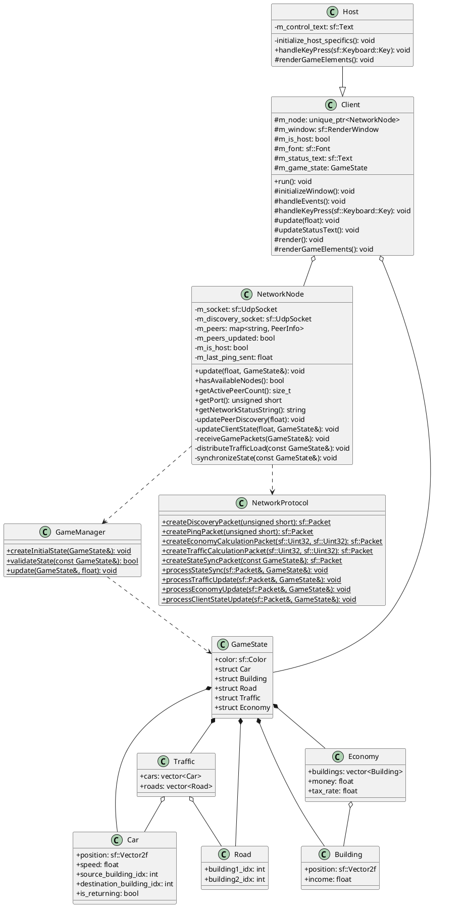
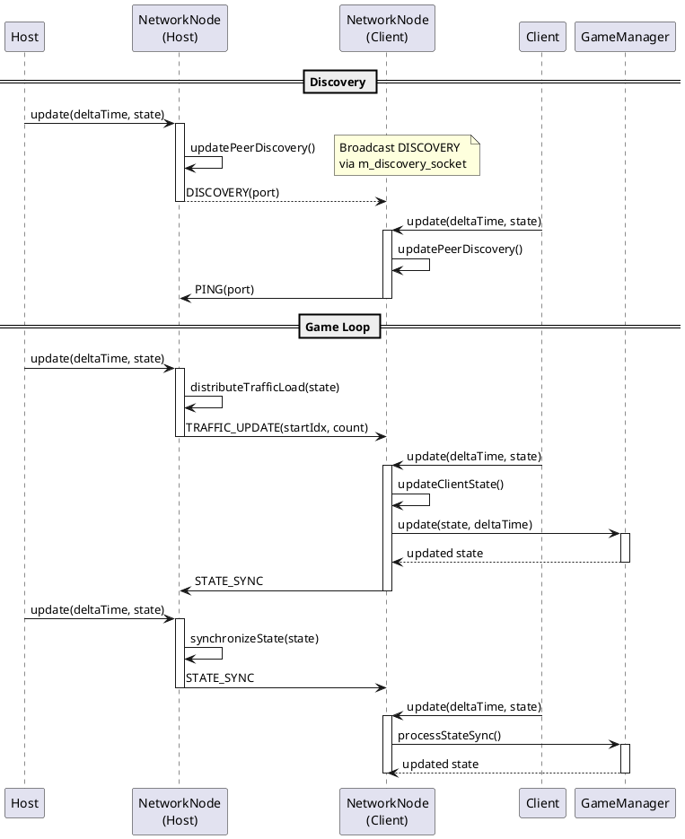

# SimCity P2P

A distributed implementation of a mini SimCity using a peer-to-peer architecture for traffic and economy simulation. Each client contributes to the simulation computations, making it a truly distributed system.

## Overview

The project demonstrates:
- Peer-to-peer architecture with distributed computation
- Real-time traffic simulation with dynamic routing
- Economic simulation with revenue generation and taxation
- SFML-based graphical interface with real-time visualization
- UDP-based network protocol for efficient communication

## Architecture

The project uses a hybrid client/server architecture with P2P computation distribution:

### Core Classes

- **Client**
  - Base class handling GUI and network communication
  - Manages local game state and rendering
  - Processes distributed computation tasks
  - Maintains network connection with host

- **Host** (inherits from Client)
  - Coordinates peer discovery and management
  - Distributes computation tasks among clients
  - Maintains authoritative game state
  - Handles state synchronization
  - Additional controls for game management (F5-F8)

- **NetworkNode**
  - Manages P2P communication and computation distribution
  - Handles peer discovery and maintenance
  - Uses UDP sockets for efficient communication
  - Implements timeout detection for peer management
  - Distributes traffic and economy calculations

- **GameManager**
  - Static class handling game logic and state updates
  - Manages car movement and pathfinding
  - Handles building income generation
  - Validates game state consistency

- **NetworkProtocol**
  - Defines communication protocol between nodes
  - Handles packet serialization/deserialization
  - Implements different message types for various game aspects
  - Ensures proper state synchronization

- **GameState**
  - Contains complete game state data
  - Manages traffic simulation state (cars, roads)
  - Handles economic state (buildings, money)
  - Color-coded client identification



### Communication Protocol

The protocol uses two UDP sockets per node:

1. **Discovery Socket (Port 45678)**
   - `DISCOVERY`: Broadcast by host (every 1s)
     - Contains host's game port
     - Used for peer discovery
   - `PING`: Sent by clients (every 1s)
     - Contains client's game port
     - Maintains connection alive
     - 5s timeout for inactive peers

2. **Game Socket (Custom Port)**
   - `TRAFFIC_DISTRIBUTION`
     - Host->Client: Assigns car subset for movement calculation
     - Client->Host: Returns updated car positions
   - `ECONOMY_DISTRIBUTION`
     - Host->Client: Assigns building subset for income calculation
     - Client->Host: Returns updated building states
   - `STATE_SYNC`
     - Host->All: Complete game state broadcast
     - Ensures consistency across all clients

### Data Flow

1. **Discovery Phase**
   ```
   Host                    Client
    |                        |
    |-- DISCOVERY broadcast->|
    |                        |
    |<-------- PING ---------|
    |                        |
    |-- Add client to peers->|
   ```

2. **Game Loop**
   ```
   Host                    Client
    |                        |
    |-- TRAFFIC_DISTRIBUTION ----->|
    |                        |-- Process cars
    |<-- Updated positions --|
    |                        |
    |-- ECONOMY_DISTRIBUTION ----->|
    |                        |-- Process buildings
    |<-- Updated economy ----|
    |                        |
    |-- STATE_SYNC --------->|
   ```

3. **Computation Distribution**
   - Traffic: Each client processes N/M cars (N=total cars, M=clients)
   - Economy: Each client processes N/M buildings
   - Load balancing adjusts to client count changes



## Features

### Traffic Simulation

- Dynamic car movement between buildings
- Velocity and direction calculations
- Collision-free pathfinding
- Distributed computation across clients
- Color-coded cars per client

### Economic Simulation

- Building revenue generation
- Global taxation system
- Distributed economic calculations
- Real-time income updates
- Financial indicators display

### Graphical Interface

- Real-time visualization of:
  - Buildings and roads
  - Moving vehicles
  - Economic indicators
  - Network status
- Color-coded client identification
- Host-specific control panel

## Building and Running

### Prerequisites

- Modern C++ compiler (C++17 or later)
- SFML 2.5+ (graphics and network modules)
- Linux environment (tested on Debian-based systems)

### Dependencies Installation

```bash
# Debian/Ubuntu
sudo apt-get install libsfml-dev
```

### Compilation

```bash
g++ --std=c++17 -Wall -Wextra -Wshadow *.cpp -o prog `pkg-config --cflags --libs sfml-graphics sfml-network`
```

### Execution

1. Start the host:
```bash
./prog host [port]  # i.e. port: 45000
```

2. Start one or more clients:
```bash
./prog client [port]  # i.e port: 45001
```

## Controls

### Host Controls

- `F5`: Start new simulation
  - Generates random buildings
  - Creates road network
  - Spawns initial cars
- `F6`: Pause/Resume simulation
- `F7`: Save current state
- `F8`: Load saved state
- `Escape`: Exit application

### Client Controls
- `Escape`: Exit application
