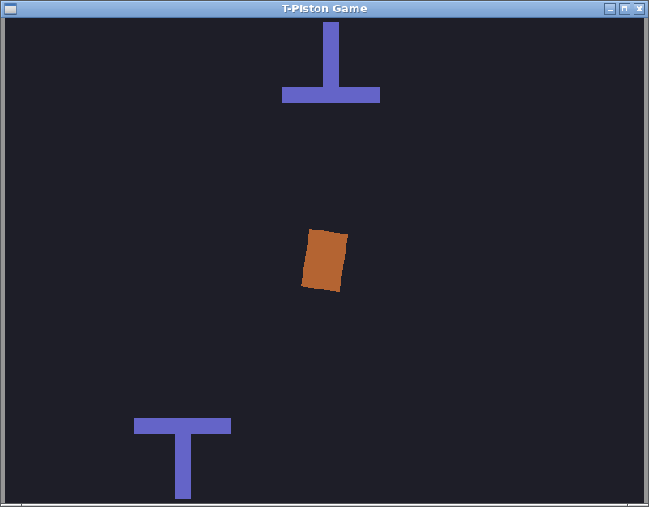

# T-shape Piston Game

Small game, generated by AI, where the player moves horizontally (left/right keys) and pushes vertically a piston (space key) in order to displace a cardboard. If the cardboard reaches the bottom or the top of the screen, it is regenerated.



This game idea comes from a real robotic cell packaging cardboard, where I wanted to simulate it with the aim of validating the GRAFCET.

## Ubuntu/Debian

Needs SFML and box2d.

```bash
sudo apt-get install libsfml-dev libbox2d-dev
```

## Compilation

```bash
g++ -o piston_game main.cpp -lsfml-graphics -lsfml-window -lsfml-system -lbox2d
```
