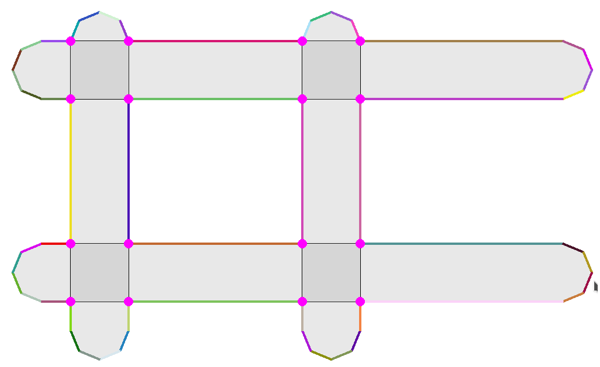
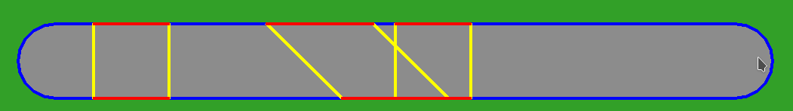

# Road junctions

Project made in C++ and displayed with SFML. Compilation:
```
g++ --std=c++14 Application.cpp RoadJunctions.cpp `pkg-config --cflags --libs sfml-graphics`
```

The goal of this project is to get the list of borders of intersecting roads for a SimCity-like game.
When roads intersect, it is interesting to remove segments that make the road junction (i.e., for better
display where ground painting is overlapping, but also knowing in which portion of the road a car is).

In this code:
- Roads are given, as input, as a list of segment lines (better to use a graph structure instead of a list,
  but this is not in the scope of this project).
- The output is a list of borders for each road and displayed with different colors (for debug purposes).
- Roads are displayed as 2D capsule shapes, like in SimCity game.
- The algorithm iterates on roads:
  - detect where segments constituting the shape intersect.
  - split these segments that intersect.
  - remove segments contained by another road (in the junction).

Here an example obtained with 4 roads (2 horizontals, 2 verticals):



- pink dots show segment intersections.
- thin black segments are segments of the initial road shapes.
- fat colorful segments are kept border segments.

Since the algorithm iterates on segments to remove the ones contained by another road, we can keep the removed
segments to get road junctions. In the next figure, a horizontal road has been split by three vertical roads
(not displayed). Red segments are segments belonging to the roads; yellow segments are segments belonging to the
other intersecting roads; blue segments are borders.



## Work in progress

- Pedestrian crossing, inner lines are not yet displayed.
- Make the union of removed segments to make the shape of road junctions.
- The algorithm is not perfect:
  - Some intersection may not be detected (because I'm using float instead of double).
  - The algorithm iterates on segments, but split segments are inserted in this iteration (because they can split other segments), and two segments in contact are considered as intersecting, and if not cared for, they are inserted, provoking
  an infinite loop.

## Credits

This code is based from the Youtube video "A Virtual World - JavaScript Course: Lesson 4 / 11 Polygon Operations in JavaScript" by Radu Mariescu-Istodor https://youtu.be/3Aqe7Tv1jug?si=NN2ANPUDVZIJNs43 and code available at https://github.com/gniziemazity/virtual-world

Here are my differences:
- `Envelope` has been renamed as `RoadShape`. The road shape wraps the SFML polygon class `sf::ConvexShape` and is used for
   painting the ground and knowing if a point is inside.
- `Polygon` has been renamed as `Road`. The road class has a `RoadShape` and contains the list of its borders. Some methods
   have been moved to the `Editor` class.
- `RoadBorder` inherits from `Segment` and is owned by `Road`. This class also handles their display.
- `World` does not exist and is merged directly into the SFML window (named `Editor`) to make the project simple.
- I used a different intersection algorithm based on https://cp-algorithms.com/geometry/segments-intersection.html that
  needs a `LineEquation` structure; structure created from `RoadBorder`.
- Contrary to the original project, computed borders are not held by the `World` class but by the `Road`.

## Optimizations

Alternatively, a sweep-Line Algorithm for Line Segment Intersection https://www.youtube.com/watch?v=qkhUNzCGDt0
(known as Bentley-Ottmann algorithm https://en.wikipedia.org/wiki/Bentley%E2%80%93Ottmann_algorithm) could be used. For example: https://github.com/valenpe7/bentley-ottmann or https://github.com/the-hyp0cr1t3/sweepline-intersections
