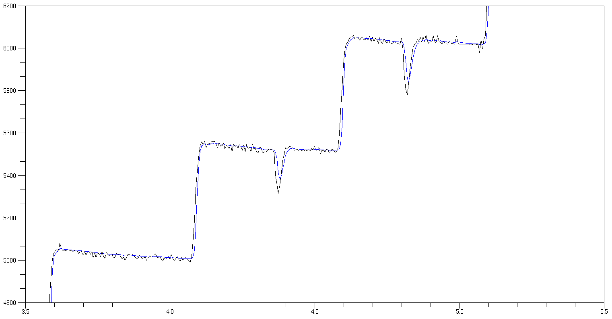

# Kalman filter 1-dimension

Based on:
- [Professor Michel van Biezen lectures](https://www.youtube.com/playlist?list=PLX2gX-ftPVXU3oUFNATxGXY90AULiqnWT)
- https://github.com/denyssene/SimpleKalmanFilter



*Fig 1 - plot obtained with ScicosLab*

- Compilation:

```
g++ --std=c++11 -Wall -Wextra -Wshadow *.cpp -o kalman
```

- Run:

```
./kalman > res.csv
```

- Plot. Choose your option:
  - call ScicosLab and plot.sci script.
  - call gnuplot: `gnuplot --persist plot.gnuplot`
