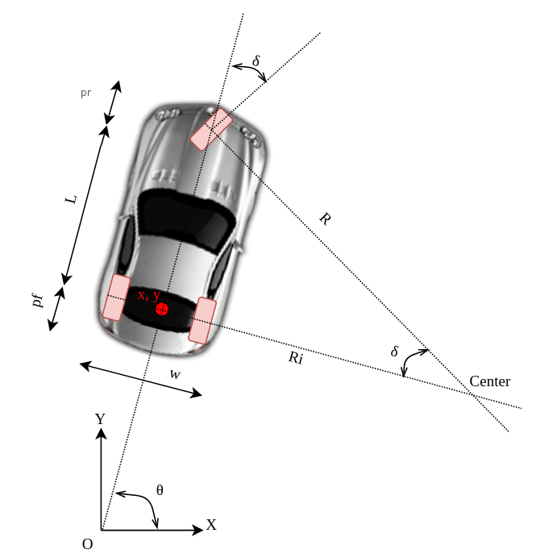

# C++ with International System of Units

Test two libraries:
- https://github.com/bernedom/SI
- https://github.com/nholthaus/units

On a simple car kinematic using the tricycle kinematic equations.

Equation:

tricycle:

