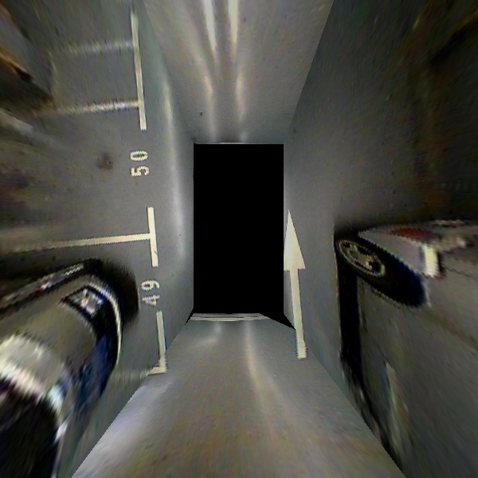
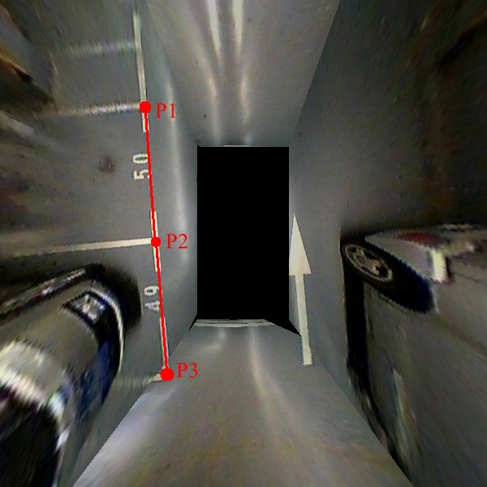
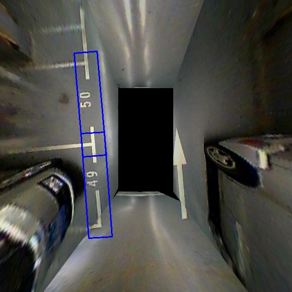
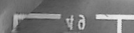
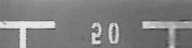

# Region Of Interest from an Segment Line

In a given image, let suppose that a region with the shape of an oriented rectangle is interesting us and we want to crop it. This Python code is helping us to do this.

Why we need an oriented rectangle as region of interest ?

From an input image, like this one:

in which points and segment lines are defined in the associated [file](doc/input.mat). For example:

After "inflating" these segments to obtain the oriented rectangles as bounding boxes, are shown in this figure:

After croping these oriented rectangles we obtained these two images:

and:

