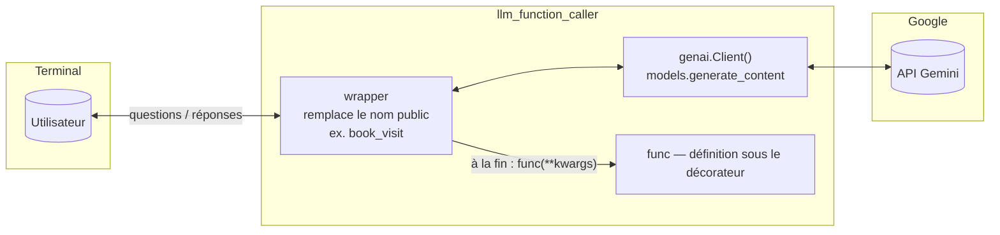
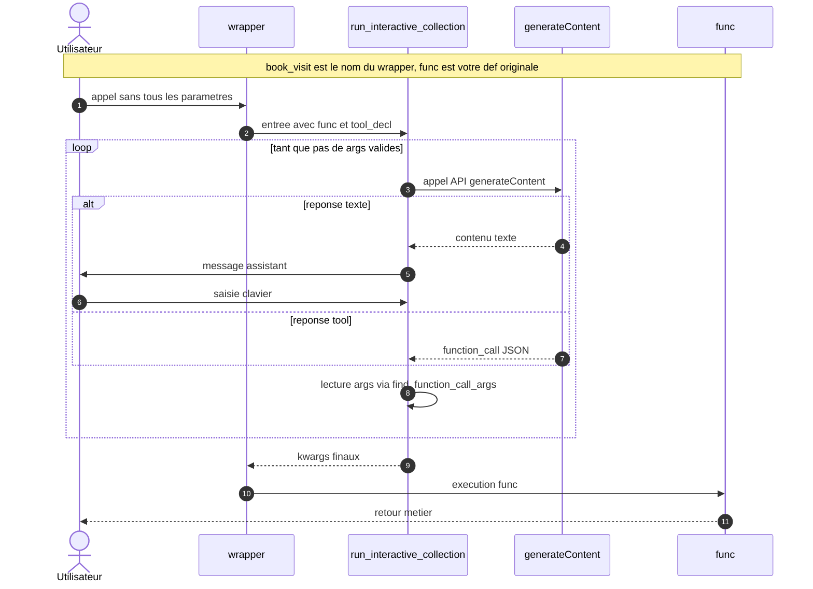
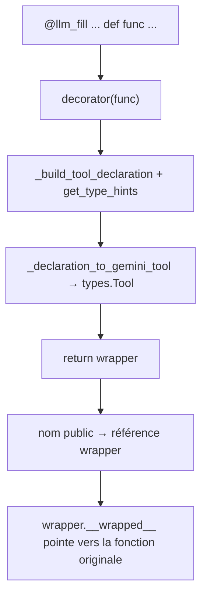
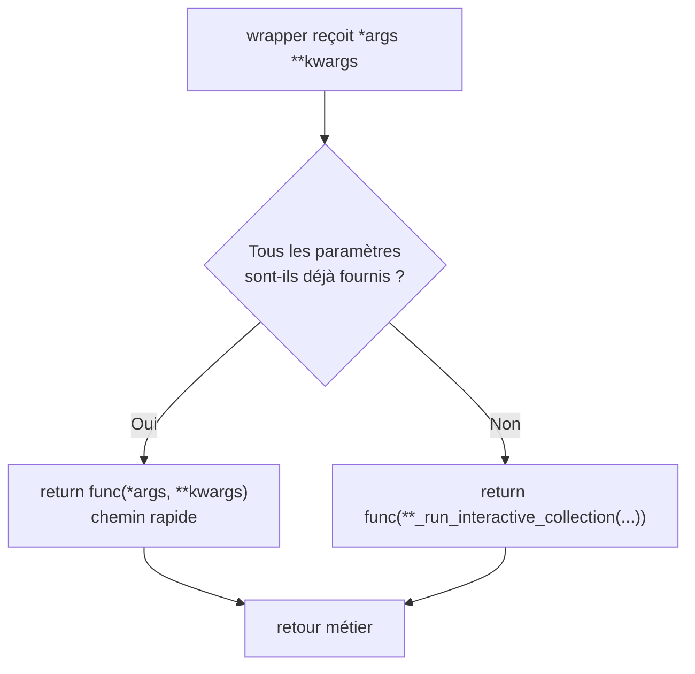
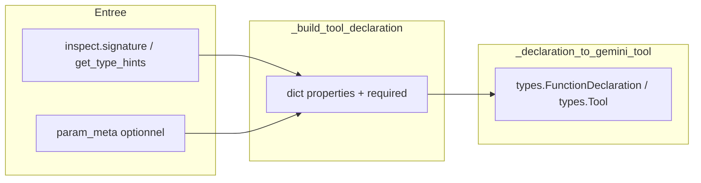

# LLM Function Calling en Python avec Gemini

Ce petit projet montre comment lier une **fonction Python** réelle avec le **function calling** d’un LLM via un **décorateur**.

## Concepts

### LLM Function Calling (« tool use »)

Un modèle capable de *function calling* peut, en plus du texte, émettre un **appel de fonction structuré** : nom d’outil + arguments souvent représentés en JSON conforme à un schéma (types, champs obligatoires, énumérations, etc.).

- **À quoi ça sert ?** À ce que le modèle prépare une action pour votre code (formulaire dynamique, commande métier, requête API) sans que vous parliez tout en prompt libre puis ne parsiez à la main.
- **Flux ici** : Gemini reçoit la description d’un outil (`FunctionDeclaration`). Il peut soit poser des questions à l’utilisateur en langage naturel, soit décider que les infos sont complètes et **appeler l’outil** avec des `args`.

Le fichier `llm_function_caller.py` désactive l’appel automatique du SDK : votre Python **lit** ces `args` et appelle la fonction métier sous-jacente (contrôle total côté app).

### Décorateurs Python

Un décorateur est une fonction qui **en enveloppe une autre**. En écrivant :

```python
@llm_fill(system_prompt="...", param_meta={...})
def ma_fonction(x: str) -> dict:
    ...
```

Python exécute l’équivalent de : `ma_fonction = llm_fill(...)(ma_fonction)`.

Dans **`llm_function_caller.py`**, la chaîne d’appels est :

| Nom dans le code | Rôle |
|------------------|------|
| **`llm_fill`** | Fabrique de décorateur (paramètres : `system_prompt`, `model`, `param_meta`) ; renvoie la fonction **`decorator`**. |
| **`decorator`** | Fonction interne qui reçoit votre fonction métier `func`, construit le schéma d’outil via **`_build_tool_declaration`**, puis renvoie le remplaçant **`wrapper`**. |
| **`wrapper`** | Nom **exact** de la fonction interne définie dans `llm_fill` (c’est le terme habituel en Python pour « fonction de remplacement »). C’est **`wrapper`** que vous invoquez quand vous tapez `book_visit()` ou `ma_fonction()` : elle intercepte l’appel et décide du chemin rapide ou de la boucle LLM. |
| **`wrapper.__wrapped__`** | Référence conservée vers la fonction Python **originale** non décorée (pour débogage ou introspection). |
| **`_run_interactive_collection`** | Boucle terminal ↔ **`client.models.generate_content`** jusqu’à un `function_call` dont les `args` sont appliqués à `func`. |
| **`_build_tool_declaration`** | Construit le dictionnaire neutre (propriétés, `required`) à partir de `inspect.signature` et **`get_type_hints`**. |
| **`_declaration_to_gemini_tool`** | Convertit cette déclaration en **`types.Tool`** / **`FunctionDeclaration`** Gemini. |
| **`_find_function_call_args`**, **`_model_text_response`** | Extraient respectivement l’appel d’outil et le texte assistant depuis une réponse Gemini. |

**Pourquoi le mot « wrapper » ?** Ce n’est pas un concept Gemini : dans le fichier source, la fonction de substitution s’appelle littéralement `def wrapper(*args, **kwargs):`. En documentation Python, *wrapper* désigne souvent « la fonction qui enveloppe une autre ». Ici, le *wrap* consiste à ajouter la logique LLM **autour** de votre `func` d’origine.

- Si tous les arguments sont déjà fournis, **`wrapper`** appelle directement **`func`** (pas d’API).
- Sinon, **`wrapper`** appelle **`_run_interactive_collection`**, puis **`func(**collected)`**.

Voir les exemples concrets avec `@llm_fill` dans **`examples.py`**.

## Schémas (comment ça fonctionne)

Les diagrammes suivants utilisent la syntaxe **Mermaid** (affichage correct sur GitHub, GitLab, VS Code, etc.).

### 1. Chaîne des responsabilités

Vue d’ensemble : qui fait quoi entre le terminal, la fonction **`wrapper`** (voir le tableau ci‑dessus), Gemini et votre fonction métier **`func`**.



- **`wrapper`** parle à Gemini via **`_run_interactive_collection`** (qui utilise **`client.models.generate_content`**).
- **`func`** est la fonction que vous avez définie avec `def` sous le décorateur ; elle est réellement appelée avec les kwargs collectés (ex. **`func(**collected)`** dans le code).

### 2. Séquence : boucle interactive jusqu’à l’appel d’outil

Comportement du **chemin lent** : vous avez appelé `ma_fonction()` **sans** fournir tous les paramètres. Le module désactive l’exécution automatique d’outils côté SDK : **votre** code applique `args` à la fonction Python.



Dans le code source, **`RIC`** correspond à **`_run_interactive_collection`**, et **`GC`** à l’appel **`client.models.generate_content`** (SDK `google.genai`).

**À retenir** : le nom public (`book_visit`, etc.) est **`wrapper`** ; la fonction **`func`** est celle que le décorateur a stockée. Gemini peut enchaîner plusieurs tours avant un `function_call` valide ; l’historique est la liste **`contents`** dans **`_run_interactive_collection`**.

### 3. Flux : à la définition du décorateur

Au **import** ou à la définition de la fonction, Python exécute **`llm_fill(...)(func)`** : le **décorateur** interne exécute **`_build_tool_declaration`**, puis **`_declaration_to_gemini_tool`** prépare l’outil Gemini ; le nom public (`book_visit`, …) désigne désormais **`wrapper`**.



### 4. Décision : chemin rapide ou collecte LLM

Quand vous appelez la fonction décorée, c’est le code de **`wrapper`** (dans **`llm_fill`**) qui choisit entre un appel direct et la boucle.



Critère dans **`wrapper`** : soit **`len(args) == len(sig.parameters)`**, soit **`set(kwargs) == set(sig.parameters)`** — sinon appel à **`_run_interactive_collection`** puis **`func(**collected)`**.

### 5. Données : de la signature Python au schéma d’outil

Transformation principale (schéma logique, pas un format de fichier imposé) :



## Dépendances et clé API

Créez une clé : [Google AI Studio](https://aistudio.google.com/apikey) (`GOOGLE_API_KEY` ou `GEMINI_API_KEY`).

Ajoutez par exemple dans votre profil shell :

```bash
export GOOGLE_API_KEY="votre clé"
```

## Installation et exécution

```bash
cd BacASable/Python/FunctionCalling
python3 -m venv .venv
. .venv/bin/activate
pip install -r requirements.txt
python examples.py
```

### Erreur `404 NOT_FOUND` sur un modèle

Le message du type `models/gemini-… is not found` ou « not supported for generateContent » signifie que l’identifiant passé à `@llm_fill(model="...")` **n’existe pas pour votre clé** ou **ne supporte pas** l’appel utilisé ici.

Lister les modèles exposés par l’API (avec `generateContent`) :

```bash
python examples.py --list-models
```

Pour afficher **tous** les modèles renvoyés par l’API (pas seulement ceux avec `generateContent`) :

```bash
python examples.py --list-models --all
```

Réutilisez l’**identifiant court** affiché sur la ligne `• ...` (ex. `gemini-2.5-flash`) dans `@llm_fill(model="...")`.

En Python, vous pouvez aussi importer `print_available_gemini_models` ou `iter_gemini_models` depuis `llm_function_caller`.

Le fichier **`llm_function_caller.py`** contient la bibliothèque (sans démo interactive) ; **`examples.py`** contient deux scénarios métier, le choix du **job** en langage naturel via **`choose_job`** (function calling), puis les options CLI.

## Références dans le dépôt

| Fichier | Rôle |
|--------|------|
| `llm_function_caller.py` | Voir le tableau *Décorateurs Python* : `llm_fill`, `decorator`, `wrapper`, `_build_tool_declaration`, `_declaration_to_gemini_tool`, `_run_interactive_collection`, `_find_function_call_args`, `_model_text_response`, ainsi que pour les modèles : `model_api_id`, `iter_gemini_models`, `print_available_gemini_models` |
| `examples.py` | `choose_job` (routage LLM), `JOBS`, `book_visit`, `order_pizza`, `main`, `--list-models` / `--all` |
| `requirements.txt` | `google-genai` |
