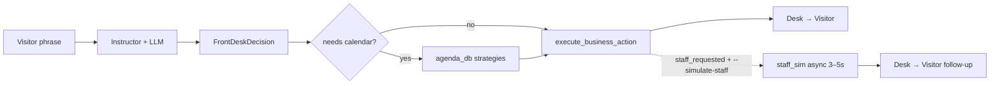

# Front-desk routing with Instructor

One-shot extraction: visitor phrase → flat Pydantic model → rigid Python dispatch.

Companion to [StructuredDataExtraction](../StructuredDataExtraction/):

| | StructuredDataExtraction | Instructor (here) |
|---|--------------------------|-------------------|
| Mechanism | Gemini function calling (`@llm_fill`) | `response_model` Pydantic (Instructor) |
| Interaction | Multi-turn Q&A loop | **One-shot** per phrase |
| Schema | Python signature → JSON Schema tool | Single flat Pydantic model |
| Use case | Progressive form filling | Routing / classification + field extraction |

## Flat schema only (all providers)

We use one model — `FrontDeskDecision` — for **every** provider (Gemini, Mistral, Groq…).

Pydantic Unions are avoided:

- Gemini rejects them via Instructor ([documented limitation](https://python.useinstructor.com/integrations/google/)).
- Mistral often raises validation errors with discriminated unions in practice.

Shape: `intent: Literal[...]` plus optional fields filled according to intent.

### Intents

| Intent | Meaning |
|--------|---------|
| `check_in` | Visitor arrives for an **existing** appointment |
| `book_appointment` | Schedule a **new** visit (walk-in) |
| `cancel_appointment` | Cancel a scheduled visit |
| `general_inquiry` | Off-topic question (restrooms, directions…) |

## When the visitor lacks information

### 1. Relative time ("now" → `appointment_at`)

Pass `now_iso` in the system prompt with explicit conversion rules. Use `--now` on the CLI to simulate a fixed clock (see below).

### 2. Visitor forgot something

**Anti-pattern:** ask the visitor again.

**Pattern:**

```python
needs_app_assistance: bool      # app cannot finish alone
resolution_hint:     Optional[str]  # log/UI hint only
```

Then `agenda_db.apply_strategies()` runs typed calendar lookups — not on free-text hints.

| Trigger | Strategy |
|---------|----------|
| `check_in` + visitor known + `host_name` is None | Calendar lookup → fill host |
| `check_in` + visitor + host + `appointment_at` is None | Calendar lookup → fill time |
| `cancel_appointment` + visitor known | Locate appointment (filter "tomorrow" if mentioned) |

Check-in is **always** reconciled with the in-memory calendar (`_resolve_check_in`, `_merged_fields`).

## Staff simulation (async)

When the desk cannot finish alone (unknown visitor, past slot, cancel not found…), `execute_business_action` returns `BusinessOutcome` with `staff_requested=True`.

With `--simulate-staff`:

1. The desk tells the visitor to wait.
2. `[Staff] Paging reception…` — random pause **3–5 s** (`asyncio.sleep` in `staff_sim.py`).
3. A second LLM call decides whether someone arrives (`staff_arrived`) and what to say next.

```bash
python examples.py --simulate-staff --phrase "Hello, I'm Robert Foo, here to check in."
```

## CLI

```bash
python examples.py                                          # 10 demo cases
python examples.py --phrase "Hi, I'm Thomas Martin..."      # single phrase
python examples.py --model mistral/mistral-small-latest
python examples.py --now "2026-06-16 21:30" --phrase "..."  # simulated clock
python examples.py --simulate-staff --phrase "..."          # staff pager demo
```

`--now` affects:

- the LLM time context (`now_iso`, "today is…"),
- business logic (`_arrival_kind`, late vs early),
- seed appointments in `reset_calendar(now=…)` so demo cases stay coherent.

Accepted formats: `2026-06-16 21:30`, `2026-06-16T21:30`, with optional seconds.

## Demo scenarios (`examples.py`)

| Case | Scenario |
|------|----------|
| 1 | Check-in now — Thomas Martin / Julie (use `--now` after 20:00 for "past slot") |
| 2 | Check-in — Sarah forgot host → calendar lookup |
| 3 | Cancel Marc Durant tomorrow |
| 4 | General inquiry (restrooms) |
| 5 | Marie Dubois — appointment tomorrow, not today |
| 6 | Léa Petit — forgot time → calendar lookup |
| 7 | Robert Foo — unknown visitor → staff pager |
| 8 | Double cancel Marc (already removed) |
| 9 | Book new appointment — Alice Wonder |
| 10 | Cancel Alice's visit just booked |

## LLM errors

A simple `try/except Exception` is enough for this demo.

## Free-tier providers

| Provider | Env var | Example model |
|----------|---------|---------------|
| Google AI Studio | `GOOGLE_API_KEY` / `GEMINI_API_KEY` | `google/gemini-2.5-flash` |
| Groq | `GROQ_API_KEY` | `groq/llama-3.3-70b-versatile` |
| Mistral | `MISTRAL_API_KEY` | `mistral/mistral-small-latest` |
| OpenRouter | `OPENROUTER_API_KEY` | `openrouter/...:free` |

> Mistral SDK: pin `mistralai>=1.5.1,<2.0.0` (Instructor 1.x compatibility).

## Installation

```bash
cd BacASable/Python/LLM/Instructor
python3 -m venv .venv
. .venv/bin/activate
pip install -r requirements.txt
export GOOGLE_API_KEY="your-key"
python examples.py
```

```bash
export MISTRAL_API_KEY=...
python examples.py --model mistral/mistral-small-latest
```

## Files

| File | Role |
|------|------|
| `guichet_router.py` | `FrontDeskDecision`, LLM call, dispatch |
| `agenda_db.py` | In-memory appointments + resolution strategies + `BusinessOutcome` |
| `staff_sim.py` | Async staff pager simulation (3–5 s + LLM) |
| `examples.py` | Demo scenarios + CLI (`--now`, `--simulate-staff`) |
| `requirements.txt` | `instructor[google-genai]`, `mistralai<2` |

## Flow



The model **fills** the schema; your code **decides** using its own data.
