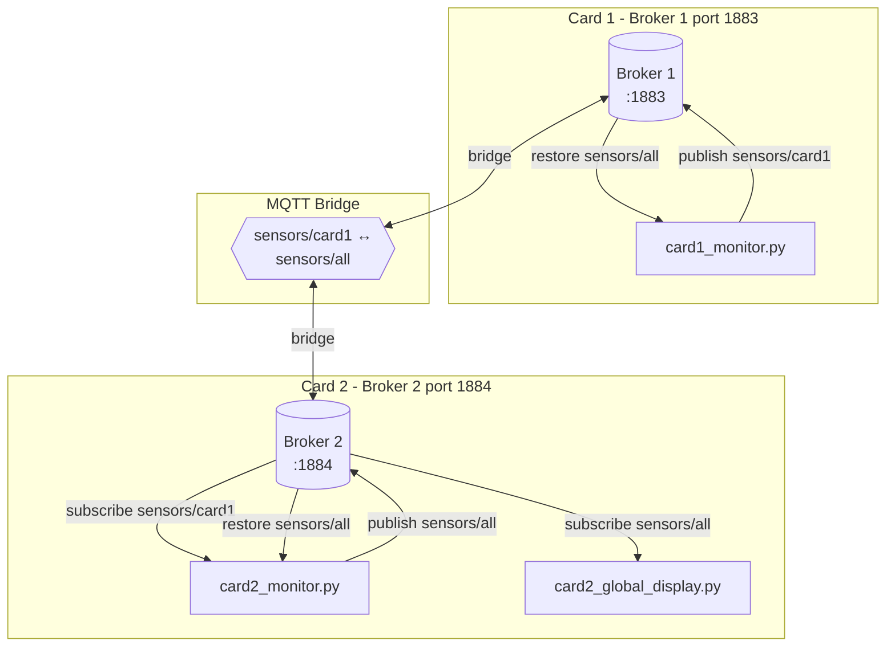

# MQTT Dual-Board Sensor Monitoring System

A Python-based sensor monitoring system simulating two electronic boards communicating via MQTT with automatic state persistence and restoration.

## What This Project Simulates

This project simulates **two real electronic boards** communicating over a network, each with its own MQTT broker:

- **Board 1** runs a single service (`card1_monitor.py`) that monitors **3 sensors** (sensors 1-3). Each sensor can be in OK or KO state.

- **Board 2** runs two services:
  - `card2_monitor.py` - Monitors **3 local sensors** (sensors 4-6) with OK/KO states, and receives sensor states from Board 1
  - `card2_global_display.py` - A **display service** that shows the consolidated status of all 6 sensors from both boards

In a real-world scenario, each board would be a separate embedded device (e.g., Raspberry Pi, Arduino, industrial PLC) with its own network stack and MQTT broker. The boards communicate through an **MQTT bridge** that synchronizes messages between the two brokers.

## Architecture



### Components

| Card | Components | Broker |
|------|------------|--------|
| **Card 1** | `card1_monitor.py` | Broker 1 (localhost:1883) |
| **Card 2** | `card2_monitor.py` + `card2_global_display.py` | Broker 2 (localhost:1884) |

### MQTT Topics

| Topic | Content | Published by | Used for |
|-------|---------|--------------|----------|
| `sensors/card1` | Sensors 1-3 states | card1_monitor | Card 1 → Card 2 communication |
| `sensors/all` | Sensors 1-6 states | card2_monitor | Display + State restoration for all |

## MQTT Settings for Reliability

This system uses the following MQTT settings to ensure **no state is ever lost**:

### QoS 2 (Exactly Once Delivery)

- Guarantees that each message is delivered exactly once
- Uses a 4-step handshake: PUBLISH → PUBREC → PUBREL → PUBCOMP
- Prevents duplicate or lost messages

### Retained Messages (`retain=True`)

- The broker stores the last message on each topic
- When a client subscribes, it immediately receives the last retained message
- Enables state restoration after restart

### Persistent Sessions (`clean_session=False`)

- The broker remembers client subscriptions across disconnections
- Queued messages (QoS 1/2) are delivered when the client reconnects
- Combined with retained messages, ensures complete state persistence

## Installation

### Prerequisites

Install Mosquitto MQTT broker and clients:

```bash
# Fedora
sudo dnf install mosquitto mosquitto-clients

# Ubuntu/Debian
sudo apt-get install mosquitto mosquitto-clients

# macOS
brew install mosquitto
```

Install Python dependencies:

```bash
pip install paho-mqtt
```

> **Note:** `tkinter` is usually included with Python. If not:
> ```bash
> # Fedora
> sudo dnf install python3-tkinter
>
> # Ubuntu/Debian
> sudo apt-get install python3-tk
> ```

## Running the System

### Step 1: Start Broker 1 (Card 1)

```bash
mosquitto -p 1883 -v
```

### Step 2: Start Broker 2 with Bridge (Card 2)

```bash
mosquitto -c mosquitto_bridge.conf -v
```

### Step 3: Launch Applications

Open separate terminals for each application:

```bash
# Terminal 3 - Card 1 Monitor
python card1_monitor.py

# Terminal 4 - Card 2 Monitor (bridge between cards)
python card2_monitor.py

# Terminal 5 - Global Display
python card2_global_display.py
```

## Testing State Persistence

1. Start all components as described above
2. Change some sensor states by clicking the buttons
3. Stop `card2_monitor.py` (Ctrl+C or close window)
4. Verify that `card2_global_display.py` stops receiving updates (as expected)
5. Restart `card2_monitor.py`
6. **Observe:** All sensor states (1-6) are automatically restored!

## Bridge Configuration

The `mosquitto_bridge.conf` file configures Broker 2 to bridge with Broker 1:

```conf
# Broker 2 listens on port 1884
listener 1884

# Bridge connection to Broker 1
connection bridge_to_broker1
address localhost:1883

# Import sensors/card1 from Broker 1 (QoS 2)
topic sensors/card1 in 2

# Export sensors/all to Broker 1 (QoS 2)
topic sensors/all out 2
```

## What Does MQTT Bridge Mode Do?

An **MQTT bridge** connects two separate MQTT brokers and automatically replicates messages between them based on configured topic patterns. This enables communication between isolated networks or devices that each have their own broker.

### How the Bridge Works

```
┌─────────────────────┐                    ┌─────────────────────┐
│     Broker 1        │                    │     Broker 2        │
│   (localhost:1883)  │                    │   (localhost:1884)  │
│                     │                    │                     │
│  sensors/card1  ────┼──── BRIDGE ────────┼──> sensors/card1    │
│  (published here)   │    replicates      │  (received here)    │
│                     │                    │                     │
│  sensors/all <──────┼──── BRIDGE ────────┼─── sensors/all      │
│  (received here)    │    replicates      │  (published here)   │
└─────────────────────┘                    └─────────────────────┘
```

### Bridge Direction Keywords

| Keyword | Direction | Description |
|---------|-----------|-------------|
| `in`    | Remote → Local | Messages published on remote broker are copied to local broker |
| `out`   | Local → Remote | Messages published on local broker are copied to remote broker |
| `both`  | Bidirectional | Messages are synchronized in both directions |

### Why Use a Bridge Instead of a Single Broker?

1. **Network isolation** - Each board can operate independently even if the network link fails
2. **Scalability** - Distribute load across multiple brokers
3. **Security** - Control which topics are shared between networks
4. **Realistic simulation** - Mimics real embedded systems where each device has its own broker

## Data Flow

1. **card1_monitor.py** publishes sensor 1-3 states to `sensors/card1` on Broker 1
2. The **bridge** replicates `sensors/card1` to Broker 2
3. **card2_monitor.py** receives card1 states, combines with local sensors 4-6, publishes to `sensors/all`
4. The **bridge** replicates `sensors/all` back to Broker 1
5. **card2_global_display.py** displays all 6 sensor states
6. On restart, each component subscribes to `sensors/all` and restores its own sensors from the retained message

## License

MIT License
