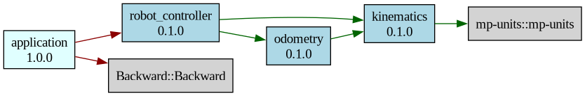

# 🏗️ CMake C++ Infrastructure

A reusable CMake infrastructure for C++ multi-module projects. It provides high-level functions to declare libraries and executables with automatic source discovery, strict compiler warnings, precompiled headers, sanitizers, code coverage, doxygen, stack trace (backward-cpp), unit tests (GoogleTest) and more. Dependencies are managed via Conan. Two single functions do all the work: `library()`, `executable()`.

This infrastructure expects each module to follow a standard directory layout (sources and headers are discovered as `*.c`, `*.cpp`, `*.h`, `*.hpp` only):

```bash
<module>/
├── CMakeLists.txt
├── include/<module>/   # Public headers (or include/<subdir>/ when using SUBDIRECTORIES)
├── src/                # Sources and private headers
├── mocks/              # Mock implementations (optional)
├── pch/                # Custom precompiled header (optional)
│   └── pch.hpp
└── tests/              # GoogleTest unit tests (optional)
```

The demo libraries (`kinematics`, `odometry`, `robot_controller`) live under [`robot/`](robot/) in a **multi-subdirectory** layout (`include/<name>/`, `src/<name>/`, …) with one `library()` call per target and the `SUBDIRECTORIES` keyword. They are **examples only**. The demo uses [mp-units](https://mpusz.github.io/mp-units/) for SI unit handling (velocities in m/s, rad/s) installed from Conan.

---

## 🗂️ CMake Files

All infrastructure files live in the `cmake/` directory. Include `ProjectBootstrap.cmake` once from your root `CMakeLists.txt` to enable everything. `ProjectBootstrap.cmake` is the single entry point including other cmake files.

| File | Purpose |
|------|---------|
| `Module.cmake` | Main API: `library()`, `executable()`, and private `_module_*` helpers (glob, banner, configure, gtest). |
| `Conan.cmake` | Conan 2.x integration. Provides `find_conan_package()` wrapper. |
| `Compiler.cmake` | Default build type, PIC, LTO, debug flags, `target_set_warnings()`. |
| `PCH.cmake` | Precompiled headers: global auto-generated PCH and custom per-module PCH support. |
| `Testing.cmake` | `BUILD_TESTING` option, GoogleTest (via Conan), CTest integration. |
| `Stacktrace.cmake` | Crash stack traces via backward-cpp (Conan). Auto-linked on executables. |
| `Summary.cmake` | Automatic project summary box, configuration summary, dependency graph (`build/dependencies.dot`). |
| `Sanitizers.cmake` | `target_enable_sanitizers()` for ASAN, UBSAN, TSAN. |
| `Coverage.cmake` | `target_enable_coverage()` and `coverage`/`coverage-open`/`coverage-clean` targets. |
| `DebugSymbols.cmake` | Split DWARF (`.dwo` files) and separated debug symbols at install time. |
| `Doxygen.cmake` | `docs` target for HTML API documentation with Doxygen. |
| `PrettyPrint.cmake` | Formatted console output (boxed titles, key-value sections). |

## ⚙️ Build Options

| Option | Default | Description |
|--------|---------|-------------|
| `CMAKE_BUILD_TYPE` | `Release` | Build configuration: `Debug`, `Release`, `MinSizeRel`, `RelWithDebInfo` |
| `BUILD_TESTING` | `ON` | Build unit tests with GoogleTest |
| `ENABLE_WERROR` | `OFF` | Treat compiler warnings as errors |
| `ENABLE_STACKTRACE` | `ON` | Enable backward-cpp crash stack traces |
| `ENABLE_LTO` | `OFF` | Link Time Optimization (Release builds only) |
| `ENABLE_SPLIT_DWARF` | `OFF` | Split debug info into `.dwo` files for faster linking |
| `ENABLE_ASAN` | `OFF` | AddressSanitizer: detects buffer overflows, use-after-free, memory leaks |
| `ENABLE_UBSAN` | `OFF` | UndefinedBehaviorSanitizer: detects integer overflow, null dereferences |
| `ENABLE_TSAN` | `OFF` | ThreadSanitizer: detects data races and deadlocks (incompatible with ASAN) |
| `ENABLE_COVERAGE` | `OFF` | Code coverage instrumentation with gcov/lcov |
| `ENABLE_DOXYGEN` | `OFF` | Generate HTML API documentation with Doxygen |

---

## 🛠️ Prerequisites

- CMake 3.20+
- C++20 compatible compiler (GCC 11+, Clang 14+)
- Conan 2.x package manager

All dependencies are managed via Conan 2.x. To install Conan (if not already installed)

```bash
pip install conan
conan profile detect
```

The `conanfile.txt`, at the root of the project, declares:

| Package | Version | Purpose |
|---------|---------|---------|
| [mp-units](https://github.com/mpusz/mp-units) | 2.3.0 | SI unit library for compile-time dimensional analysis |
| [GoogleTest](https://github.com/google/googletest) | 1.15.0 | Unit testing framework (when `BUILD_TESTING=ON`) |
| [backward-cpp](https://github.com/bombela/backward-cpp) | 1.6 | Crash stack traces (when `ENABLE_STACKTRACE=ON`) |

To add more dependencies, edit `conanfile.txt`:

```ini
[requires]
mp-units/2.3.0
gtest/1.15.0
backward-cpp/1.6
spdlog/1.14.1         # example: add your own packages

[generators]
CMakeDeps
CMakeToolchain
```

Then re-run `conan install . --output-folder=build --build=missing -s compiler.cppstd=20` and use `find_conan_package()` or `find_package()` in your CMake files.

---

## 🚀 Compilation

### Build the Project (release)

```bash
# 1. Install dependencies with Conan
conan install . --output-folder=build --build=missing -s compiler.cppstd=20

# 2. Configure and build
cmake --preset release
cmake --build build -j$(nproc)

# 3. Run tests
ctest --preset release

# 4. Run the demo
./build/application/application
```

### Build the Project (debug)

```bash
conan install . --output-folder=build --build=missing -s compiler.cppstd=20 -s build_type=Debug
cmake --preset debug
cmake --build build -j$(nproc)
./build/application/application
```

### Common Recipes

The `CMakePresets.json` defines some common recipes:

```bash
# AddressSanitizer (memory errors)
conan install . --output-folder=build --build=missing -s compiler.cppstd=20 -s build_type=Debug
cmake --preset asan && cmake --build build && ctest --preset asan

# UndefinedBehaviorSanitizer
conan install . --output-folder=build --build=missing -s compiler.cppstd=20 -s build_type=Debug
cmake --preset ubsan && cmake --build build && ctest --preset ubsan

# ThreadSanitizer (data races)
conan install . --output-folder=build --build=missing -s compiler.cppstd=20 -s build_type=Debug
cmake --preset tsan && cmake --build build && ctest --preset tsan

# Code coverage
conan install . --output-folder=build --build=missing -s compiler.cppstd=20 -s build_type=Debug
cmake --preset coverage && cmake --build build && ctest --preset coverage
cmake --build build --target coverage-open
# Report: build/coverage/index.html

# CI build (warnings as errors, no tests)
conan install . --output-folder=build --build=missing -s compiler.cppstd=20
cmake --preset ci && cmake --build build

# Release with LTO and stripped install
conan install . --output-folder=build --build=missing -s compiler.cppstd=20
cmake --preset release -DENABLE_LTO=ON
cmake --build build
cmake --install build --strip

# Generate API documentation
conan install . --output-folder=build --build=missing -s compiler.cppstd=20
cmake --preset release -DENABLE_DOXYGEN=ON
cmake --build build --target docs
# Output: build/docs/html/index.html
```

---

## 📥 Installation

By default, `cmake --install build` deploys to the local `install/` directory (set via `CMAKE_INSTALL_PREFIX` in the root `CMakeLists.txt`). For each module, this installs:

- Executables to `install/bin/`
- Libraries (`.a` or `.so`) to `install/lib/`
- Public headers to `install/include/`
- Runtime shared library dependencies to `install/lib/` (auto-deployed for executables)
- Debug symbols to `.debug/` subdirectories (Debug/RelWithDebInfo builds only)
- Use `NO_INSTALL` flag in `library()` or `executable()` to exclude a target from installation.

For a full installation, you have to override the install location:

```bash
cmake --install build --prefix /opt/myapp
```

### 🏷️ Stripped Release Install

For Release builds, use the `--strip` flag to install stripped binaries (smaller size, no symbol tables):

```bash
cmake --install build --strip
```

### 🐞 Separated Debug Symbols (Debug/RelWithDebInfo)

For Debug and RelWithDebInfo builds, `cmake --install` automatically separates debug symbols from installed binaries. The install tree looks like:

```
install/
├── bin/
│   ├── application             # Stripped binary (like Release)
│   └── .debug/
│       └── application.debug   # Debug symbols only
├── lib/                        # Libraries + runtime dependencies
└── include/                    # Public headers
```

This provides the best of both worlds: compact binaries suitable for deployment, and separate `.debug` files for post-mortem debugging.

The `.debug/` subdirectory follows the standard Linux convention. GDB automatically searches `<binary_dir>/.debug/` when resolving `gnu-debuglink` references, so **no extra configuration is needed**:

```bash
gdb ./install/bin/application
# GDB auto-loads install/bin/.debug/application.debug via gnu-debuglink
```

> **Note:** When using `cmake --install build --strip` on a Debug build, the automatic debug symbol separation is skipped (since CMake strips the binary before our code can extract symbols). Use the plain `cmake --install build` for debug builds to get separated symbols.

### 🧩 Component-Based Installation

Targets are automatically assigned to components based on their type:

| Component | Contents | Created by |
|-----------|----------|------------|
| `runtime` | Executables + runtime shared library dependencies | `executable()` |
| `devel` | Libraries (`.a` / `.so`) and public headers | `library()` |

This allows installing only what you need:

```bash
# Install executables only (for deployment)
cmake --install build --component runtime

# Install development files only (for SDK/library distribution)
cmake --install build --component devel
```

---

---

## 🧪 Mock System

The infrastructure provides a first-class mock system that works **without virtual functions**, **without touching the real headers**, and — critically — **without ever defining a duplicate copy of the real class's symbols**. It is a header-only "compile-time substitution" pattern, modelled after `Cpp/UnitTests/Mock2/test/MockPublisher.h`.

### Why Not the Old "Bridge `.cpp`" Approach?

A previous iteration shipped each mock as a small static library (`mock_<name>`) whose `.cpp` re-implemented the real class's methods and routed them to a `gmock` singleton. That solution had a fatal flaw: both the real lib and the mock lib defined the **same** symbols (e.g. `kinematics::DifferentialDrive::twist_to_wheels`).

Consider the textbook diamond:

```
robot_controller  ──PUBLIC──▶ kinematics
                   ──PUBLIC──▶ odometry

robot_controller_tests
   linked: robot_controller (which transitively pulls real kinematics + odometry)
   linked: mock_kinematics, mock_odometry  ← also defines the same symbols!
```

`nm` confirms the duplication:

```
$ nm --defined-only build/robot/libkinematics.a      | grep twist_to_wheels
T _ZNK10kinematics17DifferentialDrive15twist_to_wheelsERKNS_5TwistE
$ nm --defined-only build/robot/libmock_kinematics.a | grep twist_to_wheels
T _ZNK10kinematics17DifferentialDrive15twist_to_wheelsERKNS_5TwistE
```

The link only "worked" because static archives are pulled lazily — the linker silently picked one definition over the other depending on the order of `target_link_libraries`. This is an ODR violation and undefined behaviour by the standard.

### How the New Pattern Works

Each mockable class `kinematics::DifferentialDrive` ships **a single header**, no `.cpp`:

```cpp
// mocks/kinematics/DifferentialDriveMock.h
#pragma once

// Step 1 — pull in the real header with the class renamed via a macro, so all
// dependent types (Length, Twist, WheelVelocities, ...) stay in scope and are
// statically tracked: any change to those types breaks the mock at compile time.
#define DifferentialDrive _DifferentialDrive_Real
#include "kinematics/DifferentialDrive.h"
#undef DifferentialDrive

#include <gmock/gmock.h>

namespace kinematics {

// Step 2 — drop-in replacement class with the same name and namespace. It
// forwards each call to a singleton gmock instance.
class DifferentialDrive {
public:
    struct Mock {
        Mock()  { instance_ = this; }
        ~Mock() { instance_ = nullptr; }

        MOCK_METHOD(WheelVelocities, twist_to_wheels, (const Twist&), (const));
        MOCK_METHOD(Twist,           wheels_to_twist, (const WheelVelocities&), (const));
        MOCK_METHOD(Length,          wheel_radius,    (), (const));
        MOCK_METHOD(Length,          track_width,     (), (const));
    };

    DifferentialDrive(Length, Length) {}

    WheelVelocities twist_to_wheels(const Twist& t) const {
        return instance_ ? instance_->twist_to_wheels(t) : WheelVelocities{};
    }
    // ... same pattern for the other methods ...

private:
    static inline Mock* instance_ = nullptr;
};

using DifferentialDriveMock = DifferentialDrive::Mock;

} // namespace kinematics
```

### CMake Integration

`library()` discovers any `mocks/` directory and creates a `mock_<name>` **INTERFACE** library — *not* a static archive. It carries:

* `mocks/` and `include/` as `INTERFACE` include directories (mocks first so the macro-rename can find the real header);
* `-include <each *Mock.h>` as an `INTERFACE` compile option, which **force-includes** the mock at the top of every TU of the consumer test target — production sources stay untouched;
* The real library's public dependencies (so dependent value types like `Length` and `Twist` remain available);
* `GTest::gmock`.

```cmake
library(robot_controller
    SUBDIRECTORIES robot_controller
    PUBLIC_DEPENDENCIES kinematics odometry
    TEST_DEPENDENCIES   mock_kinematics mock_odometry   # diamond, now safe
)
```

When `TEST_DEPENDENCIES` contains any `mock_*`, the test target switches to **source-compile mode**: instead of linking the real `robot_controller.a` (which was built with the real classes baked in), `robot_controller`'s own `src/*.cpp` are recompiled directly into the test binary so that the force-include actually substitutes the mocked classes inside `RobotController.cpp`. The real `robot_controller.a` is **not** in the test link line.

After the refactor, `nm` confirms there is now only one definition of every symbol:

```
$ ls build/robot/libmock_*.a       # nothing — INTERFACE libs have no archive
$ nm --defined-only build/robot/libkinematics.a | grep twist_to_wheels
T _ZNK10kinematics17DifferentialDrive15twist_to_wheelsERKNS_5TwistE   # only here
```

### Singleton Lifecycle

Constructing a `Mock` object activates the singleton (`instance_ = this`); destroying it resets to `nullptr`. Just declare the mock as a fixture member:

```cpp
#include "kinematics/DifferentialDriveMock.h"   // see ordering note below
#include "odometry/WheelOdometryMock.h"

#include <gtest/gtest.h>
#include "robot_controller/RobotController.h"

class RobotControllerTest : public ::testing::Test {
    kinematics::DifferentialDriveMock drive_mock_;
    odometry::WheelOdometryMock       odom_mock_;
    robot_controller::RobotController ctrl{0.05*m, 0.30*m, 1000, 0.05*s};
};
```

### Include-Ordering Rule

The `*Mock.h` header **must** be visible before any other include that pulls in the real header. The build does this transparently with `-include`, but it is good practice to also list the explicit includes at the top of the test source so IDE / clangd indexing without the build flags also sees the mock first.

### Writing Tests with `EXPECT_CALL`

```cpp
TEST_F(RobotControllerTest, StepDelegatesToDriveAndOdometry) {
    using namespace kinematics;
    EXPECT_CALL(drive_mock_, twist_to_wheels(Twist{0.5*(m/s), 0.0*(rad/s)}))
        .WillOnce(Return(WheelVelocities{10.0*(rad/s), 10.0*(rad/s)}));
    EXPECT_CALL(drive_mock_, wheel_radius()).WillOnce(Return(0.05*m));
    EXPECT_CALL(odom_mock_,  update(_, _)).Times(1);

    ctrl.step({0.5*(m/s), 0.0*(rad/s)});
}
```

### Trade-offs

| Criterion | Header-only (this pattern) | Old `.cpp`-bridge |
|-----------|---------------------------|------------------|
| Multi-definition / ODR risk | None — no symbols defined | Real risk in diamond setups |
| Tracks dependent value types in real header | ✓ (real header is included via macro-rename) | ✓ |
| Tracks new methods on the real class | Partial — caught at consumer compile if used | ✓ (link error) |
| Dependent libraries can be safely linked alongside the mock | ✓ | ✗ |
| Inline methods in real headers | ✓ (mock header takes precedence) | ✗ |

If a new method is added to the real class, calls to it from the unit-under-test will fail to compile (`no member named 'foo' in 'kinematics::DifferentialDrive'` against the mock). Adding the missing `MOCK_METHOD` and forwarder is then a one-line change.

---

## 📖 API Reference

### `library()`

Creates a library (static or shared) with automatic source discovery, compiler warnings, PCH, and unit tests.

```cmake
library(<name>
    [SHARED]
    [NO_INSTALL]
    [VERSION <version>]
    [PCH <path>]
    [COMPILE_OPTIONS <opt1> <opt2> ...]
    [PUBLIC_DEPENDENCIES <dep1> <dep2> ...]
    [PRIVATE_DEPENDENCIES <dep1> <dep2> ...]
    [TEST_DEPENDENCIES <dep1> <dep2> ...]
    [SUBDIRECTORIES <s1> [<s2> ...]]
    [SOURCES <src1> [<src2> ...]]
)
```

#### Arguments

| Argument | Type | Required | Description |
|----------|------|----------|-------------|
| `<name>` | positional | **Yes** | Name of the library target |
| `SHARED` | flag | No | Create a shared library (`.so`) instead of static (`.a`). Configures RPATH automatically. |
| `NO_INSTALL` | flag | No | Skip installation rules for this target. |
| `VERSION` | single value | No | Library version (sets `VERSION` and `SOVERSION` properties). |
| `PCH` | single value | No | Path to a custom PCH header (relative to module directory or absolute). Replaces the global PCH for this target. |
| `COMPILE_OPTIONS` | list | No | Extra compile flags for this target only (e.g., `-Wno-conversion` to suppress a warning). |
| `PUBLIC_DEPENDENCIES` | list | No | Libraries linked with `PUBLIC` visibility. Propagated to consumers of this library. |
| `PRIVATE_DEPENDENCIES` | list | No | Libraries linked with `PRIVATE` visibility. Used only internally. |
| `TEST_DEPENDENCIES` | list | No | Additional libraries linked to the `<name>_tests` test executable. |
| `SUBDIRECTORIES` | list | No | If set, restricts discovery to `include/<s>/`, `src/<s>/`, `tests/<s>/`, and `mocks/<s>/` for each name `s` in the list (still recursive under those roots). If omitted, the whole `include/`, `src/`, `tests/`, and `mocks/` trees are used. **Mutually exclusive with `SOURCES`.** |
| `SOURCES` | list | No | Explicit list of source files to compile (no globbing). Headers are still discovered automatically. **Mutually exclusive with `SUBDIRECTORIES`.** |

#### Automatic Behaviors

- **Source discovery**: By default, globs `src/**/*.cpp`, `src/**/*.c`, `include/**/*.hpp`, `include/**/*.h`, and the same extensions under `src/` for private headers, with `CONFIGURE_DEPENDS`. When `SOURCES` is specified, uses the explicit file list instead (headers are still discovered automatically).
- **Library type**: Creates a `STATIC` library by default, or `SHARED` if the flag is provided.
- **RPATH (shared only)**: Configures `$ORIGIN/../lib` RPATH so executables find the `.so` at runtime.
- **Alias target**: Creates `${PROJECT_NAME}::<name>` alias for safe usage in `target_link_libraries()`.
- **Include directories**: `include/` is `PUBLIC`, `src/` is `PRIVATE`.
- **Compiler warnings**: Applies strict warnings via `target_set_warnings()`.
- **GNU + Debug**: [`Compiler.cmake`](cmake/Compiler.cmake) adds `_GLIBCXX_ASSERTIONS` globally for **GCC** in the **Debug** configuration (extra libstdc++ run-time checks).
- **Sanitizers**: Applies ASAN/UBSAN/TSAN if enabled globally.
- **Coverage**: Instruments for coverage if `ENABLE_COVERAGE` is `ON`.
- **PCH**: Uses the global PCH unless `PCH` argument is provided.
- **Installation**: Installs to `lib/`, `include/` under component `devel` (unless `NO_INSTALL`).
- **Tests**: Creates `<name>_tests` executable if `BUILD_TESTING` is `ON` and matching test sources exist.
- **Install (headers)**: Installs all of `include/` by default; with `SUBDIRECTORIES`, installs each `include/<s>/` only.

#### Examples

```cmake
# Demo layout: one CMake folder, several libs under include/<lib>/, src/<lib>/ (see robot/CMakeLists.txt)
library(kinematics
    VERSION 0.1.0
    SUBDIRECTORIES kinematics
    PCH pch/pch.hpp
    PUBLIC_DEPENDENCIES
        mp-units::mp-units
)

# Library with version and temporary warning suppression
library(database
    VERSION 1.2.0
    PCH
        pch/pch.hpp
    COMPILE_OPTIONS
        -Wno-conversion    # suppress for this module only
    PUBLIC_DEPENDENCIES
        nlohmann_json::nlohmann_json
    PRIVATE_DEPENDENCIES
        SQLite::SQLite3
    TEST_DEPENDENCIES
        testutils
)

# Shared library
library(mysharedlib
    SHARED
    PUBLIC_DEPENDENCIES SomeLib::SomeLib
)

# Explicit source list (no globbing) - mutually exclusive with SUBDIRECTORIES
library(mylib
    SOURCES
        src/file1.cpp
        src/file2.cpp
        src/utils/helper.cpp
    PUBLIC_DEPENDENCIES SomeLib::SomeLib
)
```

### `executable()`

Creates an executable module with automatic source discovery, compiler warnings, PCH, and optional unit tests.

```cmake
executable(<name>
    [NO_INSTALL]
    [VERSION <version>]
    [PCH <path>]
    [COMPILE_OPTIONS <opt1> <opt2> ...]
    [DEPENDENCIES <dep1> <dep2> ...]
    [TEST_DEPENDENCIES <dep1> <dep2> ...]
    [SUBDIRECTORIES <s1> [<s2> ...]]
    [SOURCES <src1> [<src2> ...]]
)
```

#### Arguments

| Argument | Type | Required | Description |
|----------|------|----------|-------------|
| `<name>` | positional | **Yes** | Name of the executable target |
| `NO_INSTALL` | flag | No | Skip installation rules and runtime dependency deployment. |
| `VERSION` | single value | No | Version metadata for the executable. |
| `PCH` | single value | No | Path to a custom PCH header (relative to module directory or absolute). Replaces the global PCH for this target. |
| `COMPILE_OPTIONS` | list | No | Extra compile flags for this target only (e.g., `-Wno-shadow`). |
| `DEPENDENCIES` | list | No | Libraries linked with `PRIVATE` visibility. |
| `TEST_DEPENDENCIES` | list | No | Libraries for tests (overrides `DEPENDENCIES` for mock injection). Falls back to `DEPENDENCIES` if not specified. |
| `SUBDIRECTORIES` | list | No | Same meaning as for `library()` for `include/`, `src/`, and `tests/`. **Mutually exclusive with `SOURCES`.** |
| `SOURCES` | list | No | Explicit list of source files to compile (no globbing). Headers are still discovered automatically. **Mutually exclusive with `SUBDIRECTORIES`.** |

#### Automatic Behaviors

- **Source discovery**: By default, globs `*.c`, `*.cpp`, `*.h`, `*.hpp` under `include/` and `src/` (either whole trees or per `SUBDIRECTORIES` entry). When `SOURCES` is specified, uses the explicit file list instead (headers are still discovered automatically).
- **Include directories**: Both `include/` and `src/` are `PRIVATE`.
- **Compiler warnings**: Applies strict warnings via `target_set_warnings()`.
- **GNU + Debug**: Same global `_GLIBCXX_ASSERTIONS` in **Debug** for **GCC** as for libraries (see [`Compiler.cmake`](cmake/Compiler.cmake)).
- **Sanitizers**: Applies ASAN/UBSAN/TSAN if enabled globally.
- **Coverage**: Instruments for coverage if `ENABLE_COVERAGE` is `ON`.
- **Stack traces**: Automatically links `Backward::Backward` for crash stack traces.
- **PCH**: Uses the global PCH unless `PCH` argument is provided.
- **Installation**: Installs to `bin/` under component `runtime` (unless `NO_INSTALL`). Automatically deploys runtime shared library dependencies to `lib/`.
- **Tests**: Creates `<name>_tests` if `BUILD_TESTING` is `ON` and test sources exist. The test executable recompiles all `src/` sources **except** `main.cpp` / `main.c`, allowing you to test application logic without the entry point.

#### Examples

```cmake
# Demo executable (see application/CMakeLists.txt)
executable(application
    VERSION 1.0.0
    PCH pch/pch.hpp
    DEPENDENCIES      robot_controller
    TEST_DEPENDENCIES mock_robot_controller
)

# Explicit source list (no globbing) - mutually exclusive with SUBDIRECTORIES
executable(mytool
    SOURCES
        src/main.cpp
        src/commands.cpp
    DEPENDENCIES SomeLib::SomeLib
)
```

### 🧩 Dependency Graph

On each configuration, CMake generates a dependency graph in Graphviz format at `build/dependencies.dot` (or `build/build/<Release|Debug>/dependencies.dot` depending on your build preset).

- **Green edges**: public dependencies
- **Red edges**: private dependencies
- **Blue nodes**: internal libraries
- **Cyan nodes**: executables
- **Grey nodes**: external libraries (typically from Conan)

To visualize the dependency graph, run:

```bash
dot -Tpng build/dependencies.dot -o dependencies.png
```

For example:



---

## 📝 Precompiled Headers (PCH)

### 🤔 When to Use Custom PCH

PCH significantly speeds up compilation by pre-processing commonly used headers once and reusing them across all translation units (i.e. STL, Qt, Boost ...).

| Situation | Recommendation |
|-----------|----------------|
| Standard module using only STL | Use global PCH (default) |
| Module with mp-units, Qt, Boost, or other heavy headers | Use custom PCH per module |
| Header-only module | No PCH needed |

### 🌐 Global PCH

By default, all targets use an auto-generated global PCH located at `${CMAKE_BINARY_DIR}/generated/global_pch.hpp`. This file contains commonly used STL headers:

- Containers: `<vector>`, `<map>`, `<set>`, `<unordered_map>`, `<unordered_set>`, `<array>`, `<deque>`, `<list>`
- Strings: `<string>`, `<string_view>`
- Memory: `<memory>`
- Utilities: `<algorithm>`, `<functional>`, `<optional>`, `<tuple>`, `<utility>`, `<variant>`
- I/O: `<iostream>`, `<sstream>`
- Misc: `<chrono>`, `<cstddef>`, `<cstdint>`, `<stdexcept>`, `<type_traits>`

The global PCH is compiled once and shared across all targets via CMake's `REUSE_FROM` mechanism.

### 🧰 Custom PCH

For modules that use heavy third-party headers (mp-units, Qt, Boost, etc.), you can specify a custom PCH:

```cmake
library(mymodule
    PCH pch/pch.hpp
)
```

**Important:** A custom PCH **completely replaces** the global PCH for that target. You can include the global PCH in your custom PCH to get all STL headers plus your module-specific headers:

```cpp
// mymodule/pch/pch.hpp
#pragma once

// Include the global PCH (all STL headers)
#include "global_pch.hpp"

// Add module-specific heavy headers
#include <mp-units/systems/si.h>
#include <boost/asio.hpp>
#include <QApplication>
```

The `#include "global_pch.hpp"` works because the generated directory (`${CMAKE_BINARY_DIR}/generated/`) is automatically added to the include path when using a custom PCH.
